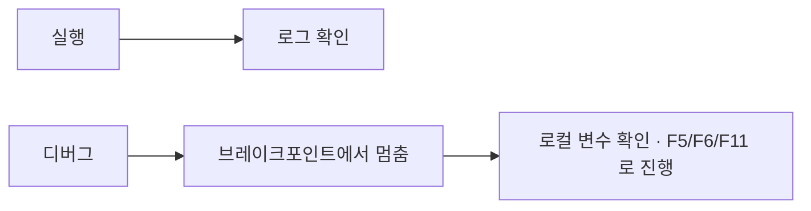

# 기본 개념

NeoRPA로 자동화를 만들기 전에 알아두면 좋은 핵심 개념을 정리합니다. 여기서 설명하는 용어는 문서 전반에서 반복해서 등장합니다.

## 프로젝트와 워크플로 { #project }

- **워크플로(Workflow)** 는 "무엇을 어떤 순서로 자동화할지"를 담은 하나의 작업 흐름입니다. NeoRPA에서 만드는 자동화의 기본 단위이며, `.xaml` 파일로 저장됩니다.
- **프로젝트(Project)** 는 서로 관련된 워크플로와 설정을 하나의 **폴더**로 묶은 단위입니다. 폴더 안에는 프로젝트 정보 파일 **`project.json`**(이름·설명·시작 워크플로)과 워크플로 파일들이 들어 있습니다. 새 프로젝트를 만들면 시작 워크플로 `Main.xaml`이 함께 생성됩니다.

프로젝트에 대해 알아두어야 할 점은 다음과 같습니다.

- 디자이너는 **한 번에 하나의 프로젝트**를 엽니다. 다른 프로젝트로 바꾸려면 리본의 `홈`으로 시작 화면에 돌아가 다시 엽니다. 저장하지 않은 변경이 있으면 먼저 저장 여부를 묻습니다.
- 액티비티에 쓰는 **상대 경로는 프로젝트 폴더를 기준**으로 해석됩니다. 파일을 읽고 쓰는 액티비티에서 `data\input.xlsx`처럼 쓰면 프로젝트 폴더 아래를 가리킵니다.
- 프로젝트의 이름은 실행 로그의 프로세스 이름으로도 쓰입니다. 리본의 `프로젝트 설정`에서 이름과 설명을 바꿀 수 있습니다.
- 프로젝트 폴더의 파일 구성은 하단 바의 `프로젝트` 패널에서 관리합니다. 자세한 사용법은 [시작하기 — 디자이너 화면 둘러보기](getting-started.md#designer)를 참고하세요.

!!! note
    프로젝트 폴더를 통째로 복사하면 다른 PC의 NeoRPA에서 그대로 열 수 있습니다. 워크플로 파일(`.xaml`) 하나만 골라 열어도 되지만, 그 경우 상대 경로의 기준은 그 파일이 있는 폴더(또는 가장 가까운 `project.json`이 있는 폴더)가 됩니다.

## 액티비티

**액티비티(Activity)** 는 워크플로를 구성하는 하나하나의 동작 블록입니다. "클릭하기", "글자 입력하기", "Excel 열기", "조건 분기" 같은 작업이 각각 하나의 액티비티입니다.

- 왼쪽 **도구상자**(하단 바의 `액티비티`)에서 액티비티를 캔버스로 끌어다 놓거나 더블클릭해 워크플로를 조립합니다.
- 액티비티를 선택하면 오른쪽 **속성 패널**에서 세부 값(대상 요소, 입력할 텍스트, 대기 시간 등)을 설정합니다.
- 액티비티는 용도별로 분류되어 있습니다: 브라우저, 데스크톱 UI, Excel, 파일, 데이터베이스, 메일, 흐름 제어 등.
- 자주 쓰는 액티비티는 도구상자에서 마우스 오른쪽 버튼으로 **즐겨찾기**에 넣어 둘 수 있습니다.

카테고리별 사용법은 [액티비티 사용법](activities/index.md)에서 확인할 수 있습니다.

## 셀렉터란 무엇인가 { #selector }

화면을 자동화하려면 "어떤 버튼을 누를지", "어느 입력창에 글자를 넣을지"를 NeoRPA에게 정확히 알려줘야 합니다. 이때 **화면 위의 특정 요소(버튼, 입력창, 링크 등)를 가리키는 지정 방법**이 바로 **셀렉터(Selector)** 입니다.

셀렉터는 요소의 종류·이름·위치 같은 특징을 기준으로 대상을 찾아냅니다. 사용자는 보통 다음과 같이 셀렉터를 만듭니다.

1. 클릭이나 텍스트 입력 같은 액티비티에서 **요소 지시(Select)** 를 시작합니다.
2. 마우스를 자동화할 화면 요소 위로 옮기면 해당 요소가 강조(하이라이트)됩니다.
3. 원하는 요소에서 클릭하면 그 요소를 가리키는 셀렉터가 자동으로 만들어집니다.

만들어진 셀렉터는 **요소 편집기**에서 확인하고 다듬을 수 있습니다. 요소 편집기의 **검증(Validate)** 은 현재 화면에서 셀렉터와 일치하는 요소 수를 알려 주고, **하이라이트**는 그 요소를 화면에 표시해 줍니다.

### 스코프와 부분 셀렉터 { #scope }

`창 연결 (스코프)`, `브라우저 연결 (스코프)` 같은 **스코프** 액티비티는 특정 창이나 브라우저 탭을 대상으로 고정하고, 그 안에 놓인 자식 액티비티들을 실행합니다. 스코프 안의 자식 액티비티는 창 정보가 빠진 **부분 셀렉터**만 가져도 되므로, 같은 창을 여러 번 다룰 때 셀렉터가 짧아지고 창 제목이 바뀌어도 한 곳만 고치면 됩니다.

!!! tip "요소를 안정적으로 찾게 하려면"
    화면 배치나 이름이 자주 바뀌는 요소는 셀렉터가 실패할 수 있습니다. 요소를 못 찾을 때는 대기 시간을 늘리거나 요소 지시를 다시 수행해 셀렉터를 갱신하세요. 데스크톱 화면에서는 이름이 조금씩 달라져도 찾아 주는 `클릭 V2`의 **유사 일치**도 대안입니다. 자세한 대처는 [문제 해결](troubleshooting.md#selector-not-found)을 참고하세요.

셀렉터의 내부 구조(요소를 표현하는 XML 형식 등)와 고급 편집 방법은 개발자 문서(RPA 관리자 전용 포털)의 **셀렉터**에서 다룹니다.

## 실행과 디버그 { #run-debug }

만든 워크플로는 NeoRPA에서 바로 **실행**할 수 있습니다.

- **실행(Run)**: 리본의 `실행`으로 워크플로를 처음부터 끝까지 동작시킵니다. 진행 상황과 결과는 하단 `출력` 패널의 **로그**에 표시됩니다. `중단`으로 언제든 멈출 수 있습니다.
- **디버그(Debug)**: 리본의 `디버깅`으로 워크플로가 의도대로 동작하는지 하나씩 확인하며 실행하는 방식입니다. 시작 전에 "디버깅 준비" 창이 잠시 나타나 워크플로를 분석합니다.

디버그에서 자주 쓰는 개념이 **브레이크포인트(Breakpoint)** 입니다.

- 특정 액티비티에 브레이크포인트를 걸어두면, 실행이 그 지점에서 **잠시 멈춥니다**.
- 멈춘 상태에서 변수 값이나 현재 상태를 확인하고, 한 단계씩 진행하며 문제를 찾을 수 있습니다.

### 디버깅 패널 { #debug-panel }

하단 바의 `디버깅`을 켜면 디버깅 패널이 열립니다. 실행이 멈춘 상태에서 다음 조작을 할 수 있습니다.

| 조작 | 단축키 | 동작 |
| --- | --- | --- |
| 계속 | F5 | 다음 브레이크포인트까지 실행을 계속합니다. |
| 스탭 단위 실행 | F6 | 현재 시퀀스/복합 액티비티를 하나의 단계로 실행합니다. |
| 한 단계씩 코드 실행 | F11 | 액티비티 시작과 시퀀스 종료 경계를 실행 순서대로 한 단계씩 실행합니다. |
| 현재 액티비티 재시도 | F7 | 멈춘 위치에서 강조된 액티비티를 다시 실행합니다. 컨테이너면 내부 전체가 다시 수행됩니다. |
| 일시중지 | F8 | 다음 액티비티에서 멈춥니다. |

패널의 **로컬** 탭에서는 현재 범위의 변수 이름·형식·값을 확인하고, **즉시** 탭에서는 식을 입력해 값을 바로 평가할 수 있습니다.

### 로그 수준 { #log-level }

실행 로그의 각 줄에는 수준이 붙습니다. `로그 메시지 출력` 액티비티로 직접 남기는 로그도 같은 수준을 사용합니다.

| 수준 | 용도 |
| --- | --- |
| Trace | 상세 진단 정보 |
| Info | 일반 진행 상황 |
| Warning | 계속 진행하지만 주의가 필요한 상황 |
| Error | 실패한 동작 |
| Fatal | 워크플로를 더 진행할 수 없는 치명적 오류 |

`로그 필드 추가`·`로그 필드 제거` 액티비티로 이후 로그에 붙는 사용자 정의 필드(예: 처리 중인 문서 번호)를 넣거나 빼서, 로그를 나중에 검색하기 쉽게 만들 수 있습니다.

!!! note
    실행이 시작되자마자 실패한다면 대개 로그에 원인이 남습니다. 로그 확인 방법은 [문제 해결](troubleshooting.md#logs)에서 설명합니다.

