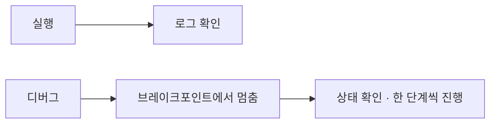

# 기본 개념

NeoRPA로 자동화를 만들기 전에 알아두면 좋은 핵심 개념을 정리합니다. 여기서 설명하는 용어는 문서 전반에서 반복해서 등장합니다.

## 프로젝트와 워크플로

- **워크플로(Workflow)** 는 "무엇을 어떤 순서로 자동화할지"를 담은 하나의 작업 흐름입니다. NeoRPA에서 만드는 자동화의 기본 단위이며, `.xaml` 파일로 저장됩니다.
- **프로젝트(Project)** 는 서로 관련된 여러 워크플로와 설정을 하나로 묶은 단위입니다. 규모가 커지면 워크플로를 프로젝트 단위로 정리해 관리합니다.

!!! note
    워크플로 파일(`.xaml`)은 NeoRPA에서 열고 편집·실행합니다. 파일을 다른 PC로 복사해 그대로 실행할 수도 있습니다.

## 액티비티

**액티비티(Activity)** 는 워크플로를 구성하는 하나하나의 동작 블록입니다. "클릭하기", "글자 입력하기", "Excel 열기", "조건 분기" 같은 작업이 각각 하나의 액티비티입니다.

- 왼쪽 **도구상자**에서 액티비티를 캔버스로 끌어다 놓아 워크플로를 조립합니다.
- 액티비티를 선택하면 오른쪽 **속성 패널**에서 세부 값(대상 요소, 입력할 텍스트, 대기 시간 등)을 설정합니다.
- 액티비티는 용도별로 분류되어 있습니다: 브라우저, 데스크톱 UI, Excel, 파일, 데이터베이스, 메일, 흐름 제어 등.

카테고리별 사용법은 [액티비티 사용법](activities/index.md)에서 확인할 수 있습니다.

## 셀렉터란 무엇인가 { #selector }

화면을 자동화하려면 "어떤 버튼을 누를지", "어느 입력창에 글자를 넣을지"를 NeoRPA에게 정확히 알려줘야 합니다. 이때 **화면 위의 특정 요소(버튼, 입력창, 링크 등)를 가리키는 지정 방법**이 바로 **셀렉터(Selector)** 입니다.

셀렉터는 요소의 종류·이름·위치 같은 특징을 기준으로 대상을 찾아냅니다. 사용자는 보통 다음과 같이 셀렉터를 만듭니다.

1. Click이나 TypeInto 같은 액티비티에서 **요소 지시(Select)** 를 시작합니다.
2. 마우스를 자동화할 화면 요소 위로 옮기면 해당 요소가 강조(하이라이트)됩니다.
3. 원하는 요소에서 클릭하면 그 요소를 가리키는 셀렉터가 자동으로 만들어집니다.

!!! tip "요소를 안정적으로 찾게 하려면"
    화면 배치나 이름이 자주 바뀌는 요소는 셀렉터가 실패할 수 있습니다. 요소를 못 찾을 때는 대기 시간을 늘리거나 요소 지시를 다시 수행해 셀렉터를 갱신하세요. 자세한 대처는 [문제 해결](troubleshooting.md#selector-not-found)을 참고하세요.

셀렉터의 내부 구조(요소를 표현하는 XML 형식 등)와 고급 편집 방법은 개발자 문서(RPA 관리자 전용 포털)의 **셀렉터**에서 다룹니다.

## 실행과 디버그 { #run-debug }

만든 워크플로는 NeoRPA에서 바로 **실행**할 수 있습니다.

- **실행(Run)**: 워크플로를 처음부터 끝까지 동작시킵니다. 진행 상황과 결과는 화면 하단의 **로그**에 표시됩니다.
- **디버그(Debug)**: 워크플로가 의도대로 동작하는지 하나씩 확인하며 실행하는 방식입니다.

디버그에서 자주 쓰는 개념이 **브레이크포인트(Breakpoint)** 입니다.

- 특정 액티비티에 브레이크포인트를 걸어두면, 실행이 그 지점에서 **잠시 멈춥니다**.
- 멈춘 상태에서 변수 값이나 현재 상태를 확인하고, 한 단계씩 진행하며 문제를 찾을 수 있습니다.

!!! note
    실행이 시작되자마자 실패한다면 대개 로그에 원인이 남습니다. 로그 확인 방법은 [문제 해결](troubleshooting.md#logs)에서 설명합니다.

