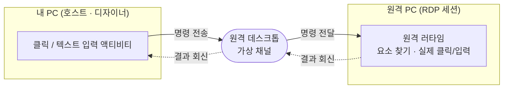

# 원격 데스크톱 자동화

NeoRPA는 **원격 데스크톱(mstsc)** 으로 접속한 원격 PC 화면 안의 버튼·입력창 같은 요소를 셀렉터로 지정해 클릭·입력할 수 있습니다. 이 문서는 이 기능이 무엇이고, 어떻게 준비하며, 어떻게 사용하는지를 사용자 관점에서 설명합니다.

## 개요

일반적인 화면 자동화는 내 PC(호스트) 화면을 대상으로 합니다. 하지만 실제 업무 프로그램이 **원격 PC** 안에서 돌아가는 경우도 많습니다. 이때 원격 데스크톱 창은 내 PC 입장에서는 그저 "그림"처럼 보이기 때문에, 그 안의 요소를 직접 클릭하기가 어렵습니다.

NeoRPA의 원격 데스크톱 자동화는 이 문제를 해결합니다. 요소를 찾고 실제 클릭·입력을 수행하는 일은 **모두 원격 PC 안에서** 일어나고, 내 PC는 "무엇을 하라"는 명령만 보냅니다. 그래서 원격 화면 안의 요소도 로컬 화면처럼 안정적으로 자동화할 수 있습니다.

!!! note
    셀렉터로 요소를 찾는 일과 실제 입력은 원격 세션 안에서 완결됩니다. 내 PC와 원격 PC는 원격 데스크톱이 제공하는 **가상 채널**로 명령과 결과만 주고받습니다.

## 준비 (설치 개요)

원격 데스크톱 자동화는 **두 곳**에 준비가 필요합니다. 한 번은 내 PC(호스트)에, 한 번은 자동화 대상인 원격 PC에 설정합니다. 원격 PC 쪽은 관리자 권한 없이 현재 사용자 기준으로 설정됩니다.

### 내 PC (호스트)

1. 최초 1회 로컬 파일 배포(`CopyLocalFiles.bat`)를 실행합니다. 원격 데스크톱 연동에 필요한 구성 요소(RDP 플러그인)가 함께 등록됩니다.
2. 이미 열려 있던 원격 데스크톱 창은 모두 닫았다가 **다시 접속**합니다. (기존 창은 새 구성 요소를 불러오지 못한 상태이기 때문입니다.)

### 원격 PC (자동화 대상)

1. 배포받은 **원격 러타임(Remote Runtime)** 압축 파일(`NeoRPA.RemoteRuntime-*.zip`)을 원격 PC로 옮깁니다. 원격 데스크톱에 접속한 상태라면 클립보드로 복사·붙여넣기하거나, mstsc 옵션의 **로컬 리소스 → 드라이브** 공유로 호스트 드라이브에서 바로 가져올 수 있습니다.
2. 원격 PC에서 압축을 풀고(위치 무관) **`install_remote.bat`** 을 실행합니다. 파일이 `C:\NeoRPA\RemoteRuntime`으로 복사되고, 로그온 시 자동 실행이 등록된 뒤 즉시 시작됩니다. 관리자 권한은 필요하지 않습니다.
3. 새 버전으로 갱신할 때도 같은 절차를 반복하면 됩니다. 이전 프로세스를 종료하고 새 파일로 덮어씁니다. 제거는 `uninstall_remote.bat`을 실행합니다.

!!! tip "설치 확인"
    설치가 끝나면 원격 PC의 작업 표시줄 트레이에 **"NeoRPA Remote Runtime"** 아이콘이 나타납니다. 이 아이콘이 보이면 원격 준비가 완료된 것입니다. 작업 관리자에 `NeoRPA.RemoteRuntime.exe`가 **2개** 보이는 것은 정상입니다. 하나는 감시자이고, 실제 작업 프로세스가 예기치 않게 종료되면 감시자가 자동으로 다시 띄웁니다.

세부 구성 요소와 동작 원리(가상 채널 프로토콜 등)는 개발자 문서(RPA 관리자 전용 포털)의 **원격 런타임 레퍼런스**에서 다룹니다.

## 사용법

### 1. 연결 확인

내 PC에서 원격 데스크톱으로 원격 PC에 접속합니다. 준비가 끝난 상태라면 접속과 동시에 내 PC와 원격 러타임 사이에 채널이 열립니다.

### 2. 요소 지시 (Select)

1. 디자이너에서 **클릭**(또는 **텍스트 입력**) 액티비티의 **요소 지시(Select)** 를 시작합니다.
2. 커서를 **원격 데스크톱 창 위로** 옮깁니다.
3. 원격 화면 안에서 대상 요소 위로 움직이면, **원격 세션 안에서 요소가 강조(하이라이트)** 되어 원격 화면에 그대로 보입니다.
4. 원하는 요소에서 클릭하면 그 요소를 가리키는 원격 셀렉터가 만들어지고, 요소의 썸네일 이미지가 액티비티에 함께 저장됩니다.

!!! note
    요소 지시 방식은 로컬 화면을 다룰 때와 동일합니다. 커서를 원격 데스크톱 창 위에 올리면 자동으로 원격 지시 모드로 전환됩니다.

만들어진 원격 셀렉터는 **요소 편집기**에서 로컬 셀렉터와 같은 방식으로 다룰 수 있습니다.

- **검증(Validate)**: 원격 세션 안에서 요소가 존재하는지 확인해 결과를 알려 줍니다.
- **하이라이트**: 해당 원격 데스크톱 창을 앞으로 가져온 뒤, 원격 화면에서 요소를 강조합니다.
- 원격 요소는 **다시 읽기(Reload)** 를 지원하지 않습니다. 요소가 바뀌었다면 요소 지시를 다시 수행하세요.

### 3. 실행 테스트

잡은 셀렉터로 워크플로를 실행하면, 명령이 원격 PC로 전달되어 **원격 세션 안에서 실제 클릭·입력**이 일어납니다.

권장 확인 순서는 다음과 같습니다.

| 단계 | 확인 내용 |
| --- | --- |
| 연결 | 원격 접속 후 채널이 정상적으로 열렸는지 (원격 트레이 아이콘 우클릭 → **로그 보기**에서 연결 로그 확인) |
| 요소 지시 | 원격 화면의 요소가 하이라이트되고 셀렉터가 채워지는지 |
| 검증 | 요소 편집기의 검증으로 요소가 원격에서 찾아지는지 |
| 실행 | 원격 메모장 등에서 실제 클릭·타이핑이 보이는지 |
| 실패 경로 | 없는 요소를 지정했을 때 대기 시간이 지나면 실패로 처리되는지 |

!!! tip
    특수키 입력(예: Enter), 필드 비우기 같은 옵션도 원격에서 동일하게 동작합니다.

## 로그 확인 { #remote-logs }

원격 자동화 문제를 진단할 때는 양쪽 로그를 함께 봅니다.

| 위치 | 로그 |
| --- | --- |
| 원격 PC | 트레이 아이콘 **우클릭 → 로그 보기**(또는 더블클릭)로 실시간 로그 창. 파일은 `%LOCALAPPDATA%\NeoRPA\remote-runtime-YYYY-MM-DD.log`(날짜별). |
| 내 PC(호스트) | `%LOCALAPPDATA%\NeoRPA\rdp-plugin.log` |

## 문제 해결

문제가 생기면 아래 표를 참고하세요. 증상별 원인과 조치를 정리했습니다.

| 증상 | 가능한 원인 | 조치 |
| --- | --- | --- |
| "mstsc 연결을 찾을 수 없습니다" | 원격 데스크톱이 실행 중이 아니거나, 준비 전에 열린 창 | 원격 데스크톱 창을 닫고 다시 접속 |
| "원격 머신이 응답하지 않습니다" | 원격 PC에서 원격 러타임이 실행되지 않음 | 원격 PC에서 `install_remote.bat`을 다시 실행하거나 트레이 아이콘 확인 |
| 채널이 연결되지 않음 | 원격 세션이 끊겼거나 채널 미연결 | 다시 접속하면 대체로 자동 회복. 원격 로그 창에서 HELLO 교환 여부 확인 |
| 입력이 전달되지 않음 | 원격 세션이 **잠김** 상태 | 원격 세션 잠금 해제 (잠긴 상태에서는 입력 불가) |
| 클릭 위치가 살짝 어긋남 | 창 크기·화면 배율(DPI) 문제 | 아래 "제약"을 참고해 창 크기·배율을 조정 |

더 자세한 진단이 필요하면 [문제 해결 / FAQ](troubleshooting.md#remote-desktop)도 함께 참고하세요.

## 제약

!!! warning "알아두어야 할 점"
    - 원격 데스크톱 창이 **스크롤바 모드**(원격 화면이 창보다 커서 스크롤이 생기는 상태)일 때는 지원되지 않습니다. 창 크기를 원격 해상도에 맞추거나 **스마트 사이징**을 켜세요.
    - 원격 세션의 화면 배율(DPI)이 100%가 아닌 경우(예: 125%)도 지원되지만, 호스트와 원격의 배율 조합이 특이하면 클릭 위치를 한 번 확인해 보는 것이 좋습니다.
    - 원격 세션이 **잠긴 상태**에서는 입력이 전달되지 않습니다.

!!! note "현재 지원 범위"
    요소 지시(Select)·검증·하이라이트와 클릭·텍스트 입력 실행은 실제 원격 데스크톱 환경에서 동작이 확인되었습니다. 일부 액티비티의 원격 지원과 다중 원격 데스크톱 창 동시 사용 등은 확장 예정입니다.
